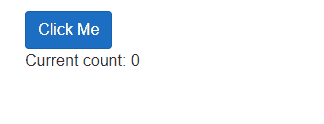

# BlazingMahi Mbutton
This is a customzed button implementation for [Blazor](https://blazor.net) and Razor Components applications. It provides the ability to disable the button when clicked.


## Getting Started

You can install the package via the NuGet package manager just search for BlazingMahi. You can also install via powershell using the following command.

```powershell
Install-Package BlazingMahi.Mbutton
```

### Add Imports
Add the following to your _Imports.razor or to your razor page files.
```csharp
@using BlazingMahi.Mbutton
```
### Add Mbutton Component
Mbutton is configured using parameters on the `<Mbutton></Mbutton>` component. The following options are available.

- Class
- OnClick
- DisableOnClick (Default: false)
- Type (Default: button )

Example: add Bootstrap button classes, OnClick event and set the disable to `true`

```html
<Mbutton Class="btn btn-primary" OnClick="IncrementCount" DisableOnClick="true">Click Me</Mbutton>

<p>Current count: @currentCount</p>

@code {
    private int currentCount = 0;

    private async Task IncrementCount()
    {
        currentCount++;
    }
}

```
The above example will disable the button when clicked and then call the `IncrementCount()` Method

### Re-enable the button after a Task is completed.
Using the component reference you have access to two methods. `EnableButton()` and `DisableButton()`

```html
<Mbutton Class="btn btn-primary" OnClick="IncrementCount" DisableOnClick="true" @ref="mbutton">Click Me</Mbutton>

@code {
    private int currentCount = 0;
    Mbutton mbutton;

    private async Task IncrementCount()
    {
        await Task.Delay(3000);
        currentCount++;
        mbutton.EnableButton();
    }
}

```

